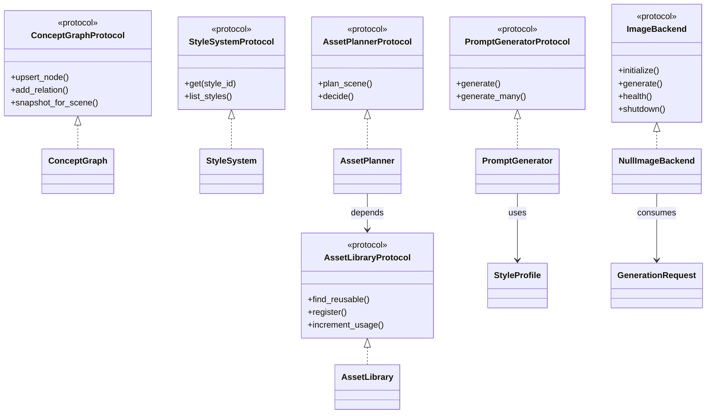
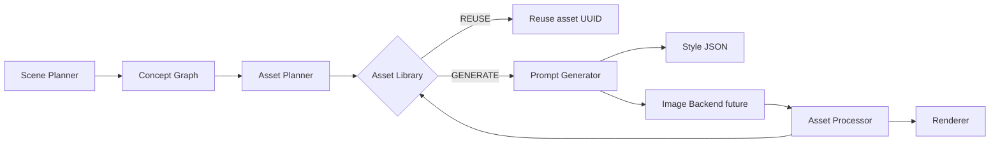

# ExplainX Phase 4.7 — Asset Intelligence Architecture

**Status:** Architecture only (no image generation, no model downloads, no inference)  
**Schema version:** `1.0.0`  
**Package:** `backend/asset_intelligence/`

## Purpose

Asset Intelligence sits between the **Scene Planner** and future **Image Backends**. It reasons about educational *concepts*, reusable *assets*, and visual *style* — never about pixels or GPU models.

## End-to-end pipeline

```text
Topic / PDF
    ↓
Content Intelligence
    ↓
Script Generation
    ↓
Scene Planner
    ↓
Concept Graph          ← educational semantics
    ↓
Asset Planner          ← reuse | generate | derive | reject
    ↓
Asset Library          ← source of truth (no duplicates)
    ↓
Prompt Generator       ← WHAT + HOW (missing assets only)
    ↓
Image Backend (Future) ← OpenVINO | Diffusers | ONNX | ComfyUI | Flux | SDXL
    ↓
Asset Processor (4.6)
    ↓
Renderer
```

## Package layout

```text
backend/asset_intelligence/
├── concept_graph/       # Concept nodes & relations
├── asset_library/       # Source of truth for assets
├── style_system/        # JSON style profiles (HOW)
│   └── styles/*.json
├── asset_planner/       # Reuse / generate / derive / reject
├── prompt_generator/    # Prompts for GENERATE only
├── image_backend/       # Null stub + future adapters
├── interfaces/          # Protocols (SOLID / DI)
├── schemas/             # Versioned dataclasses
├── caches.py            # Multi-layer cache skeleton
└── docs/                # This documentation set
```

## Component UML (logical)



## Data flow (scene → assets)



## Design principles

| Principle | Application |
|-----------|-------------|
| SOLID | Protocols in `interfaces/`; implementations inject dependencies |
| Separation of WHAT / HOW | Concepts & ontology vs style profiles |
| No duplicates | Library keys: content hash + `(semantic_name, style_id)` |
| Versioned schemas | `schema_version` on every dataclass |
| Backend swap | Single `ImageBackend` contract |
| Independent caches | Concept / Asset / Prompt / Style / Generation |

## Explicit non-goals (Phase 4.7)

- No Stable Diffusion / Flux / OpenVINO / ONNX / Diffusers integration
- No model downloads or inference
- No wiring into Renderer or Scene Composer
- No duplicate generation of existing library assets

## Related docs

- [ConceptGraph.md](ConceptGraph.md)
- [AssetOntology.md](AssetOntology.md)
- [StyleSystem.md](StyleSystem.md)
- [AssetPlanner.md](AssetPlanner.md)
- [PromptGenerator.md](PromptGenerator.md)
- [BackendInterface.md](BackendInterface.md)
- [FutureRoadmap.md](FutureRoadmap.md)
