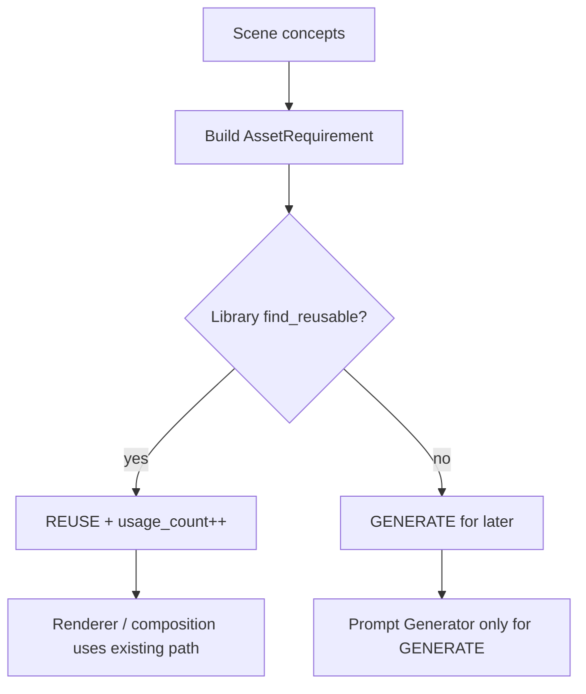

# Asset Planner

**Schema version:** `1.0.0`  
**Modules:** `asset_planner`, `schemas.planner`

## Responsibility

Given concepts for a scene + a style ID, decide per visual requirement:

| Decision | Meaning |
|----------|---------|
| `REUSE` | Library already has `(semantic_name, style_id)` |
| `GENERATE` | Missing → future ImageBackend |
| `DERIVE` | Reserved: transform an existing asset (e.g. view/style) |
| `REJECT` | Invalid / empty requirement |

## Flow



## Dependency injection

```python
planner = AssetPlanner(library)  # AssetLibraryProtocol
result = planner.plan_scene(
    scene_id="scene_1",
    concepts=nodes,
    style_id="blueprint",
)
```

Planner depends on **library protocol**, not disk or models.

## Inputs / outputs

- **In:** `ConceptNode` sequence, `style_id`, `scene_id`
- **Out:** `PlannerResult` with `decisions`, helpers `to_reuse` / `to_generate`

## Non-goals

- Does not call ImageBackend
- Does not invent prompts
- Does not receive full scene manifests (concepts only — Scene Planner extracts upstream)

## Extension points

- Smarter `DERIVE` when same concept exists in another style/view
- Cost / quality policy to prefer reuse over generate
- Project-scoped vs global library precedence
