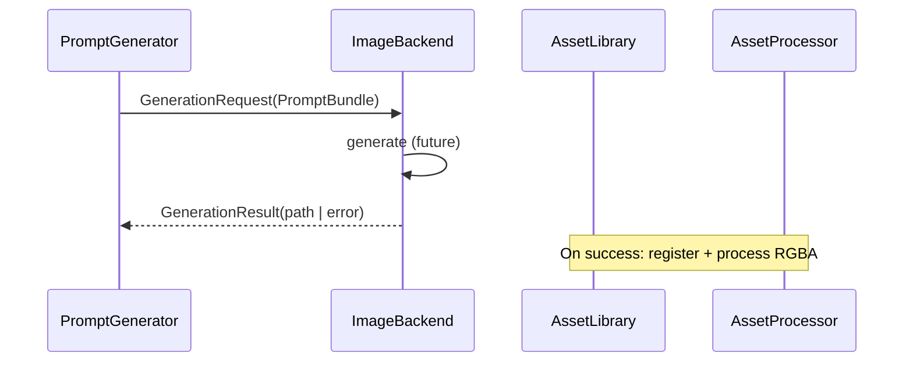

# Backend Interface

**Schema version:** `1.0.0`  
**Modules:** `interfaces.image_backend`, `image_backend.NullImageBackend`

## Contract

Every future image generation backend implements:

```python
class ImageBackend(Protocol):
    backend_id: str
    def initialize(self) -> None: ...
    def generate(self, request: GenerationRequest) -> GenerationResult: ...
    def health(self) -> dict[str, object]: ...
    def shutdown(self) -> None: ...
```

## Future backends (not implemented in 4.7)

| Backend ID (suggested) | Stack |
|------------------------|-------|
| `openvino` | OpenVINO runtime |
| `diffusers` | Hugging Face Diffusers |
| `onnx` | ONNX Runtime |
| `comfyui` | ComfyUI API |
| `flux` | Flux family |
| `sdxl` | SDXL |

All share the same protocol — orchestration code never imports model libraries directly.

## Phase 4.7 stub

`NullImageBackend`:

- `initialize` / `shutdown` toggle ready flag
- `generate` returns `FAILED` with architecture message
- `health` reports `inference: false`

## Request / result



## Extension points

1. Adapter package per backend under `image_backend/<name>/`
2. Registry: `backend_id → factory` via DI
3. Generation Cache keyed by prompt hash (independent invalidation)
4. Never put style strings in backend code — read from `PromptBundle.style`
