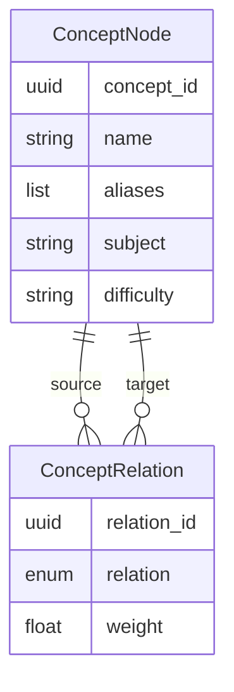
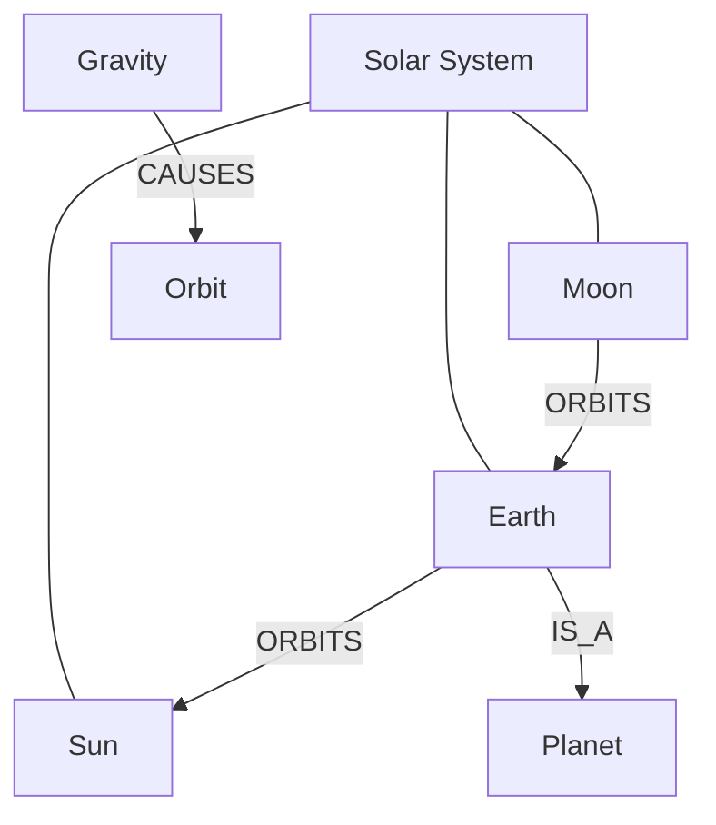

# Concept Graph

**Schema version:** `1.0.0`  
**Modules:** `schemas.concept`, `concept_graph.ConceptGraph`

## Responsibility

Understand **educational concepts**, not images. The graph answers: *what ideas appear in this scene, and how are they related?*

## Node & edge model



### Relation types

| Type | Example |
|------|---------|
| `IS_A` | Earth → Planet |
| `ORBITS` | Moon → Earth |
| `CONTAINS` | Plant Cell → Nucleus |
| `PART_OF` | Nucleus → Plant Cell |
| `CAUSES` | Gravity → Orbit |
| `RELATED_TO` | Sun ↔ Solar System |
| `OPPOSITE_OF` | Concave ↔ Convex |
| `INSTANCE_OF` | This Earth diagram → Earth |
| `REQUIRES` | Photosynthesis → Chlorophyll |
| `ILLUSTRATES` | Diagram → Concept |

## Example: Solar System

```text
Solar System
    RELATED_TO → Sun, Earth, Moon, Orbit, Gravity

Earth  --IS_A--> Planet
Moon   --ORBITS--> Earth
Earth  --ORBITS--> Sun
Gravity --CAUSES--> Orbit
```



## API (architecture skeleton)

`ConceptGraph` (in-memory) implements `ConceptGraphProtocol`:

- `upsert_node` — de-dupe by normalized name
- `add_relation` — directed typed edge
- `find_by_name` / `neighbors`
- `snapshot_for_scene` — subgraph for planner input

## Future expansion

- Persist graphs per project / curriculum pack
- NLP extraction from Scene Planner output
- Weighted path queries for related-asset suggestions
- Concept Cache layer for hot subgraphs
