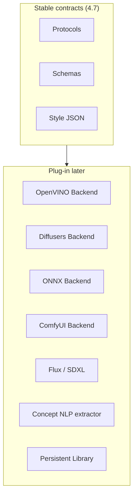

# Future Roadmap — Asset Intelligence

Phase 4.7 freezes the **architecture**. Later phases fill implementations behind the same protocols.

## Suggested phases

| Phase | Focus |
|-------|-------|
| **4.7** (this) | Schemas, protocols, skeletons, style JSON, docs |
| **4.8** | Persist Concept Graph + Asset Library (DB / files) |
| **4.9** | Wire Scene Planner → Concept extraction → Asset Planner |
| **5.0** | First ImageBackend (e.g. Diffusers or OpenVINO) — offline preferred |
| **5.1** | Generation Cache + batch generate for projects |
| **5.2** | LoRA / ControlNet mappings in style JSON |
| **5.3** | DERIVE decisions (restyle / re-view without full regen) |
| **6.x** | Curriculum packs, shared global asset CDN, quality gates |

## Extension points (summary)



## Multi-layer cache (design)

```text
Concept Cache
    ↓ invalidate independently
Asset Cache
    ↓
Prompt Cache
    ↓
Style Cache
    ↓
Generation Cache
```

Implementations live in `caches.py` (in-memory skeleton) and `interfaces/caches.py` (protocols).

## Metadata schemas (versioned)

| Schema | Module |
|--------|--------|
| Asset / Ontology | `schemas.asset` |
| Style | `schemas.style` |
| Project plan | `schemas.project` |
| Prompt / Generation | `schemas.prompt` |
| Concept / Relation | `schemas.concept` |
| Planner decisions | `schemas.planner` |

Bump `SCHEMA_VERSION` when breaking fields change; keep adapters for migration.

## Hard constraints carried forward

1. Do not generate duplicates — library is source of truth.
2. Style stays in JSON profiles.
3. Prompt Generator never takes raw scenes.
4. Backends only see `GenerationRequest`.
5. Generated files still flow through **Asset Processor (4.6)** before Renderer.

## Out of scope forever for this package

- Camera / animation logic
- FFmpeg / video encoding
- PDF parsing (upstream Content Intelligence)
